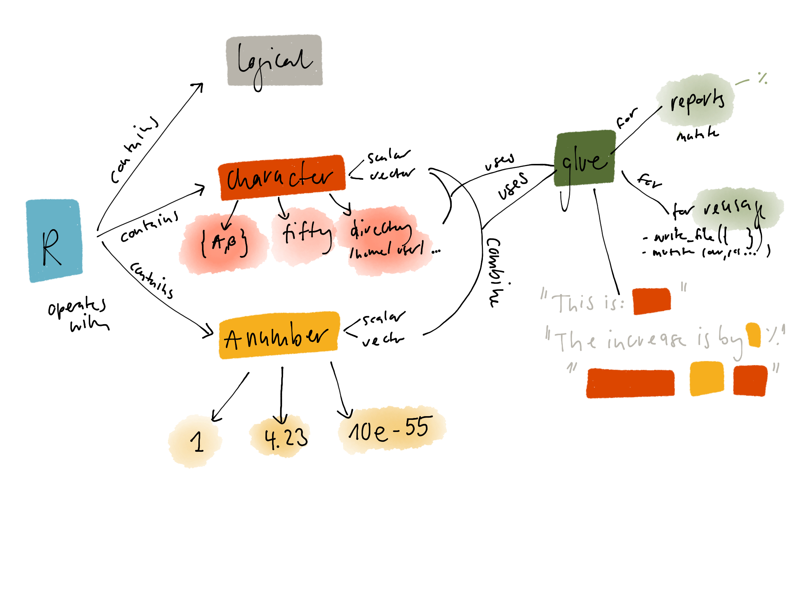

<!-- 
<!-- From here: https://slides.yihui.name/xaringan/ -->

```{r setup, include=FALSE}
options(htmltools.dir.version = FALSE)
library <- function(...) suppressPackageStartupMessages(base::library(...))
knitr::opts_chunk$set(
  tidy = TRUE
)
```

---
layout: true


---
class: left, top

# Learner persona description (1/2)

The learner persona I am addressing:

## Background
- works in the field of biology & medicine
- spends an increasing amount of time doing data analysis
- studied biology, hence not a statistician and not a computer scientist

## Experience
- uses R a few times per week, on average 2 hours per day.
- used the function `paste` before
- has not seen `glue`


---
class: left, top

# Learner persona description (2/2)


## Needs
- wants to move faster from raw data to reports
- thinks that some parts of previous reports could be recycled and used by others

## Special considerations

- works sometimes on high-performance computing clusters, hence installing glue might be a problem


---
class: left, top

# Concept map

The mental model I intend to convey.



---
class: left, top

# Requirements

```{r}
library(glue)
library(dplyr)
```

---
class: left, top

# Formative assessment 1

Tweak the following R command so that it returns

`Yesterdays average temperature was 20.2 celsius.`

```{r eval=FALSE, include=TRUE}
metric <- "celsius"
temperature <- 20.2
glue("Yesterdays average temperature was [metric] [temperature].")
```

## Solution
Replace `[]` with `{}`, or set `.open = "["` and `.close = "]"`. 


---
class: left, top
# Formative assessment 2

Predict the output of the following R code and choose solution 1, 2, 3 or 4 below.

```{r, eval=FALSE, include=TRUE}
trees <- c("pine", "fir", "cedar")
glue_collapse(trees, sep = ",", last = "and")
```

1. `pine, fir and cedar`
1. `pine,firandcedar`
1. `pine,fir,cedar`
1. `pine, firandcedar`

## Solution
2, the R code creates `pine,firandcedar`. 


---
class: left, top
# Formative assessment 3


Given the following data
```{r comment = "", tidy=FALSE}
dat <- data.frame(element = c(1, 1, 2, 2), 
                  measure = c("A", "B", "A", "B"))
dat
```

create an extra column `id` using `glue`:
```{r echo=FALSE, comment = ""}
dat %>% 
  mutate(id = glue("{element}_{measure}"))
```


---
class: left, top
# Formative assessment 3

## Solution

```{r, comment = "", tidy=FALSE}
dat %>% 
  mutate(id = glue("{element}_{measure}"))
```

---
class: left, top
# Supporting Material

- RMarkdown file: [sinarueeger.github.io/glue-tutorial/glue](https://sinarueeger.github.io/glue-tutorial/glue)
- Lecture background [sinarueeger.github.io/glue-tutorial/slides/background#1](https://sinarueeger.github.io/glue-tutorial/slides/background#1)


<!----  
- Tweak each of the following R commands so that they run correctly
- Predict R code (= use "last")
- parsons problem (order statements)
- Recreate the R code necessary to generate the following output. 
------->
