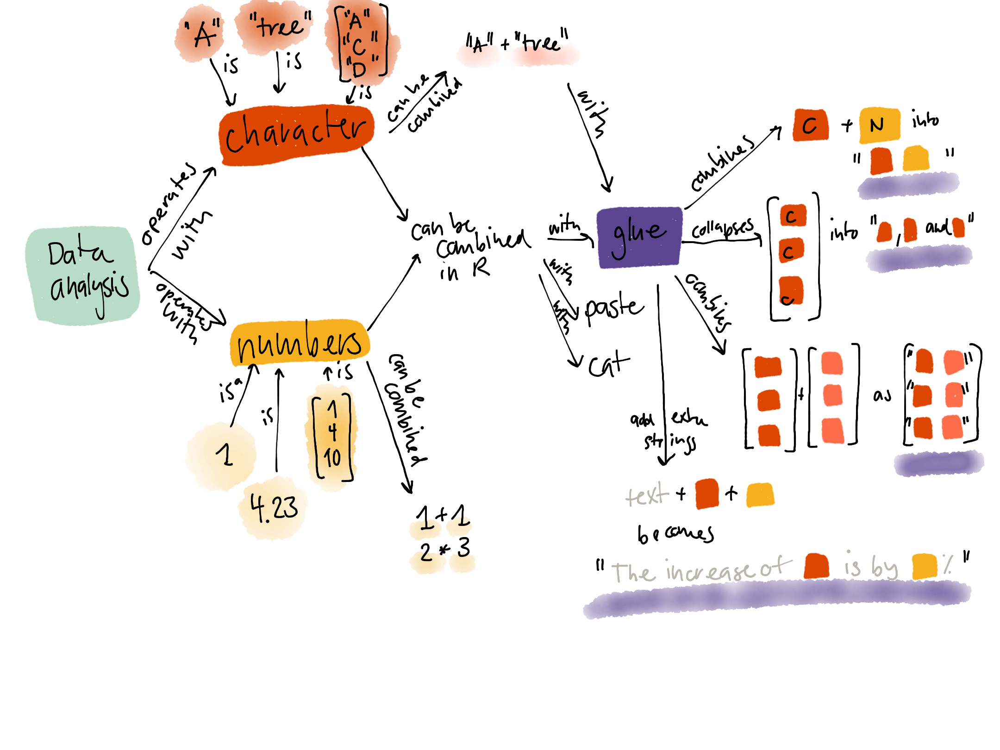

<!-- 
<!-- From here: https://slides.yihui.name/xaringan/ -->

```{r setup, include=FALSE}
options(htmltools.dir.version = FALSE)
library <- function(...) suppressPackageStartupMessages(base::library(...))
knitr::opts_chunk$set(
  tidy = TRUE
)
```

---
layout: true


---
class: left, top

# Learner persona description

The learner persona I am addressing:

## background
- works in the field of biology & medicine
- not a statistician, not a computer scientist
- data analysis is not their core activity

## experience
- uses R a few times a week next to other software
- used paste before
- has not seen glue

## needs
- move faster from raw data to reports
- produce nicer reports

## special considerations

- works on servers, hence may not be able to install glue


---
class: left, top

# Concept map

The mental model I intend to convey.



---
class: left, top

# Formative assessment 1

- multiple choice question (glue, glue_data, glue_collapse)
- parsons problem (order statements)
- Tweak each of the following R commands so that they run correctly
- Recreate the R code necessary to generate the following output.
- predict R code (= use "last")

---
class: left, top
# Formative assessment 2


---
class: left, top
# Supporting slides

Slides: [sinarueeger.github.io/glue-tutorial/slides/slides.html#1)](https://sinarueeger.github.io/glue-tutorial/slides/slides.html#1)

Examples: [github.com/sinarueeger/glue-tutorial/blob/master/glue-examples.R](https://github.com/sinarueeger/glue-tutorial/blob/master/glue-examples.R)
